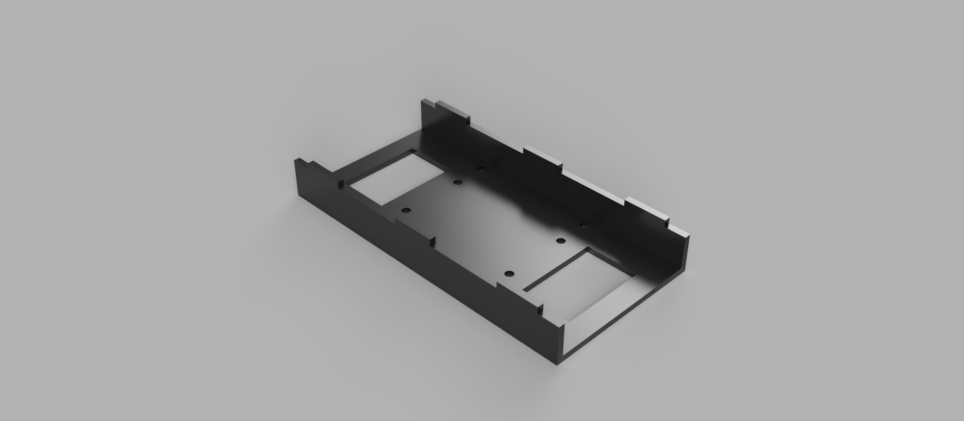

# Extinguisher Geeks [Home](homepage.md)     [About]() (mechanical documentation)

## Mechanical documentation

### Tank
The tank is a fully modular design for easy assembly, use and fabrication. The fully rendered image of the tank can be seen below.

### housing
The housing of the tank is made from pieces of 3mm acrylic plates glued together. The structure is a monocoque design which helps to save weight, thus increasing the protablility and reducing the cost of production. Chloroform, a type of acrylic glue, is applied to finger joints of the each plate to reinforce the integrity of the joint. 

### Mounting Structure
A mounting structure is also produced, with the purpose of mounting the housing to the tracks. As the housing have a larger footprint than the track base itself, the mounting platform is desgined in a way that it serves as an adaptor to compensate the difference in footprint. The image of the mounting structure can be seen below.

### Robot Arm
The robot arm is a arm kindly provided by our lecturer. It has 4 degrees of freedom. It is controlled by servo motors and linkages. 

### ESP CAM mount
The ESP CAM mount is used to mount the ESP camera via transition tight fit (H7/k6). It is glued to the robot arm and it is made from a single part. The image of the ESP CAM mount can be seen below.

### Torque calculations
The torque calculations can be found on our github  at: <a href="Tank Calculations.pptx">Tank Calculations.pptx</a>

### Mechanical CAD drawings
The mechanical CAD drawings can be found on our github at: 

f3d file format (for part files): <a href="tank fusion 360 part files.zip"> tank fusion 360 part files.zip</a>

f3z file format (for sub assemblies): <a href="tank fusion 360 sub assembly.zip">tank fusion 360 sub assembly.zip</a>

f3z file format (for full assembly): <a href="tank fusion 360 full assembly.zip">tank fusion 360 full assembly.zip</a>

STEP file format: <a href="Tank STEP files.zip"> Tank STEP files.zip</a>

### Robot arm CAD drawings
The CAD drawing for the arm can be found at <a href="https://www.thingiverse.com/thing:993759">MeArm</a>

